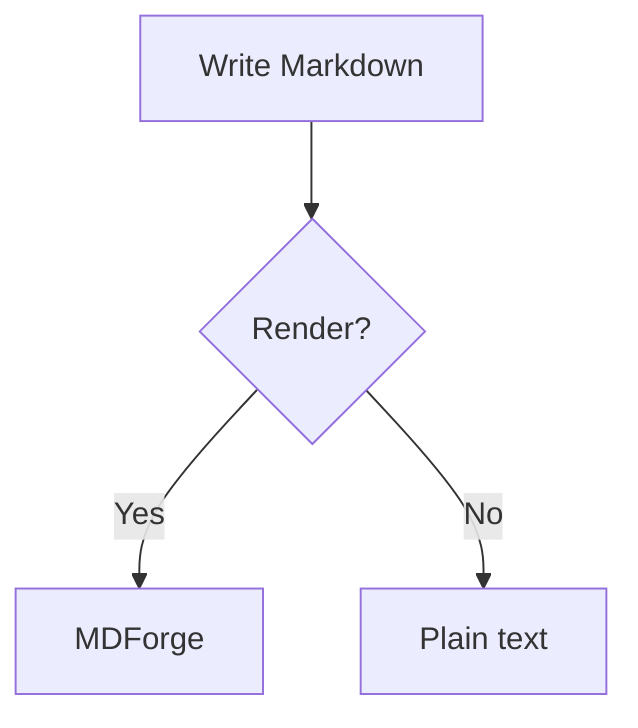

# MDForge demo

A quick document to exercise MDForge features. Open it with **MDForge**
(right-click → *Open with MDForge*).

## Nested sections (outline demo)

Use the **MDForge Outline** panel to see this collapse into a tree.

### Getting started

#### Requirements

Some text under a level-4 heading.

#### Installation

More text.

### Configuration

Text under another level-3 heading.

## Text

Normal paragraph with **bold**, *italic*, ~~strikethrough~~, `inline code`,
and a [link](https://github.com/tribaud/mdforge).

> A blockquote for good measure.

## Task list (three states)

- [ ] Not started
- [~] In progress
- [x] Done
- [ ] Click a checkbox to cycle: empty -> in progress -> done

## Footnotes

Here is a statement that needs a source.[^1] And another one.[^note]

[^1]: The first footnote definition.
[^note]: Footnotes can use named labels too.

## Wikilinks

Link to another note with [[demo]] or with an alias [[demo|this document]].
Click a wikilink to open its target.

## GitHub alerts

> [!NOTE]
> Useful information that users should know, even when skimming.

> [!TIP]
> Helpful advice for doing things better.

> [!IMPORTANT]
> Key information users need to know to achieve their goal.

> [!WARNING]
> Urgent info that needs immediate attention.

> [!CAUTION]
> Advises about risks or negative outcomes of certain actions.

## Table

| Feature | Status |
| ------- | ------ |
| Task lists | done |
| Mermaid | testing |
| Math | testing |

## Mermaid diagram



## Math

Inline: $E = mc^2$

Block:

$$
\int_{a}^{b} f(x)\,dx = F(b) - F(a)
$$

## Code block

```ts
function greet(name: string): string {
  return `Hello, ${name}!`
}
```
