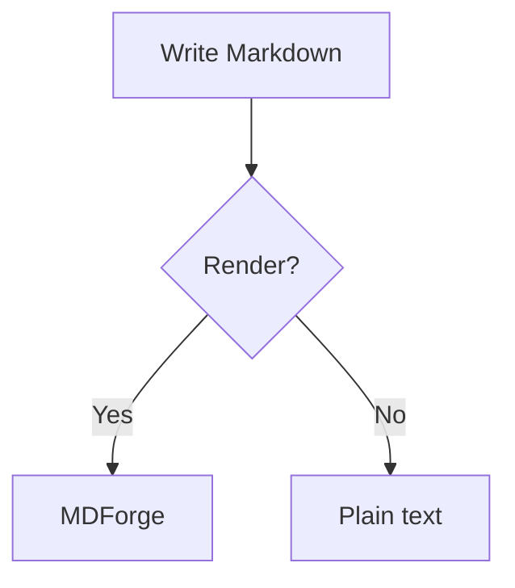

# MDForge demo

A quick document to exercise MDForge features. Open it with **MDForge**
(right-click → *Open with MDForge*).

## Text

Normal paragraph with **bold**, *italic*, ~~strikethrough~~, `inline code`,
and a [link](https://github.com/tribaud/mdforge).

> A blockquote for good measure.

## Task list (three states)

- [ ] Not started
- [~] In progress
- [x] Done
- [ ] Click a checkbox to cycle: empty -> in progress -> done

## Table

| Feature | Status |
| ------- | ------ |
| Task lists | done |
| Mermaid | testing |
| Math | testing |

## Mermaid diagram



## Math

Inline: $E = mc^2$

Block:

$$
\int_{a}^{b} f(x)\,dx = F(b) - F(a)
$$

## Code block

```ts
function greet(name: string): string {
  return `Hello, ${name}!`
}
```
