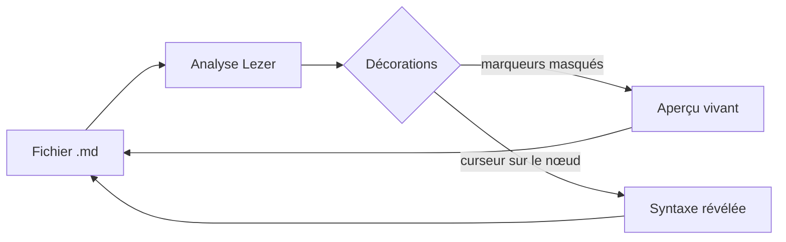

Une note ordinaire, telle qu'on l'écrit vraiment : des décisions, un tableau, un
schéma, deux formules et des tâches. Tout ce que vous voyez ici **est** le texte
Markdown du fichier — rien n'est reconstruit à l'enregistrement.

## Décisions

> [!IMPORTANT]
> Le fichier `.md` reste la source de vérité. Un caractère modifié produit un
> diff d'un caractère : l'historique git reste lisible.

- [x] Choisir le moteur d'édition — CodeMirror 6, aperçu vivant
- [~] Rédiger la documentation destinée aux utilisateurs
- [ ] Préparer la démonstration pour l'équipe

### Répartition du travail

<!--[34,22,22,22]-->
| Chantier            | Responsable | Échéance   | État        |
| :------------------ | :---------- | :--------- | :---------- |
| Moteur d'édition    | Thierry     | 2026-09-20 | **terminé** |
| Rendu des tableaux  | Thierry     | 2026-09-28 | en cours    |
| Documentation       | à décider   | 2026-10-05 | à faire     |

Les largeurs de colonnes ci-dessus se règlent à la souris : elles sont écrites
dans le commentaire HTML au-dessus du tableau, que tout autre lecteur Markdown
ignore[^portable].

## Le flux, en un schéma

## Un peu de calcul

La largeur ajustée d'un diagramme suit $w = \min(w_{\max},\ c)$, où $c$ est la
largeur de la colonne de texte. Le seuil de repli, lui, vaut :

$$
h_{\text{max}} = 0{,}8 \times h_{\text{cadre}}
$$

## Étapes suivantes

1. Relire la documentation
2. Enregistrer les captures d'écran
3. Publier

Voir aussi [[demo]] pour un tour complet des rendus.

[^portable]: Un commentaire HTML n'est rendu nulle part : le fichier reste
    lisible par n'importe quel autre outil, largeurs comprises.

<!--
  La note de démonstration : c'est elle qu'on ouvre pour les captures d'écran du
  README. Elle réunit, dans l'ordre où on les rencontre, les rendus qui méritent
  d'être montrés — carte de frontmatter, titres, tableau à largeurs, diagramme,
  maths, liste de tâches, encadré, note de bas de page. Si une fonctionnalité
  change d'allure, c'est ici qu'il faut en refaire la capture.
-->
